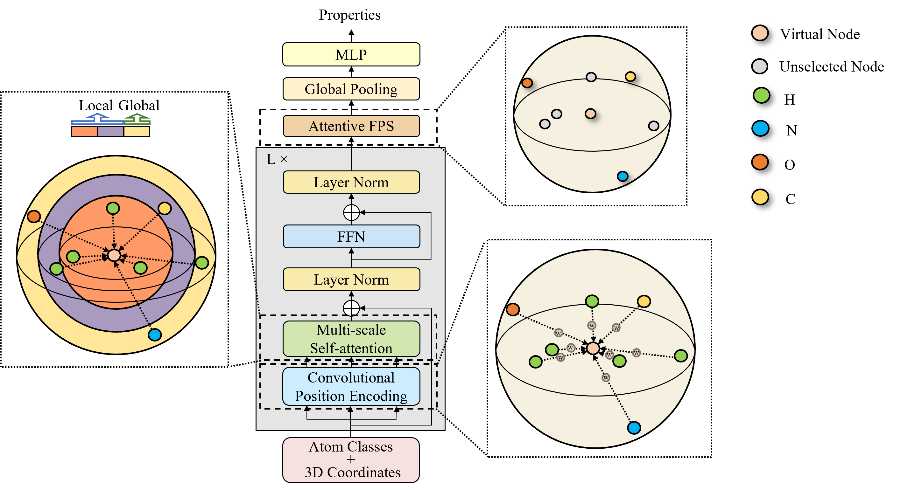

# Introduction
This is the repository for our 3D-Transformer, which achieves state-of-the-art in many molecular representation learning
 problems. *"3D-Transformer: Molecular Representation with Transformer in 3D Space (arXiv 2021)"*   
[[arXiv](https://arxiv.org/abs/2110.01191)]] [[Code](https://github.com/smiles724/3D-Transformer)]




# Intsallation 
 ```bash
# Install packages
pip install pytorch scikit-learn mendeleev
```
 
 
# Dataset
We test our model in three different domains: quantum chemistry, material science, and proteomics. You can download the 
raw dataset in the following links.  
## Quantum Chemistry
**QM7 Dataset**  
Download (Official Website): `http://quantum-machine.org/datasets/ `  
Discription (DeepChem): `https://deepchem.readthedocs.io/en/latest/api_reference/moleculenet.html#qm7-datasets`

**QM8 Dataset**  
Download (DeepChem): `https://github.com/deepchem/deepchem/blob/master/deepchem/molnet/load_function/qm8_datasets.py`   
Discription (DeepChem): `https://deepchem.readthedocs.io/en/latest/api_reference/moleculenet.html?highlight=qm7#qm8-datasets` 


**QM9 Dataset** 
Download (Atom3D): `https://www.atom3d.ai/smp.html`   
Download (Official Website): `https://ndownloader.figshare.com/files/3195389`  
Download (MPNN Supplement): `https://drive.google.com/file/d/0Bzn36Iqm8hZscHFJcVh5aC1mZFU/view?resourcekey=0-86oyPL3e3l2ZTiRpwtPDBg`   
Download (Schnet): `https://schnetpack.readthedocs.io/en/stable/tutorials/tutorial_02_qm9.html#Loading-the-data` 


**GEOM-QM9 Dataset** 
Download (Official Website): `https://doi.org/10.7910/DVN/JNGTDF`
Tutorial of usage: `https://github.com/learningmatter-mit/geom/blob/master/tutorials/01_loading_data.ipynb`  
 

## Material Science  
**COREMOF**  
Download (Google Drive):  `https://drive.google.com/drive/folders/1DMmjL-JNgUWQDU-52_DT_cX-XWNEEi-W?usp=sharing`   
Reproduction of PointNet++: `python coremof/reproduce/main_pn_coremof.py`  
Reproduction of MPNN: `python coremof/reproduce/main_mpnn_coremof.py`  
Repredoction of SchNet: (1) load COREMOF `python coremof/reproduce/main_sch_coremof.py`  
(2) run SchNet `spk_run.py train schnet custom ../../coremof.db ./coremof --split 900 100 --property LCD --features 16 --batch_size 20 --cuda`  
(Note: official script of Schnet cannot be reproduced successfully due to the memory limitation.)  
 

## Proteomics  
**PDBbind**  
Atom3d: `https://github.com/drorlab/atom3d`  
(1) download 'split-by-sequence-identity-30' dataset from `https://www.atom3d.ai/`  
(2) install atom3D `pip install atom3d`  
(3) preprocess the data by running `python pdbbind/dataloader_pdb.py`  


# Models
`models/tr_spe`: 3D-Transformer with Sinusoidal Position Encoding (SPE)  
`models/tr_cpe`: 3D-Transformer with Convolutional Position Encoding (CPE)    
`models/tr_msa`: 3D-Transformer with Multi-scale Self-attention (MSA)    
`models/tr_afps`: 3D-Transformer with Attentive Farthest Point Sampling (AFPS)    
`models/tr_full`: 3D-Transformer with CPE + MSA + AFPS   

# Quick Tour
After processing the dataset, it is time to establish the model. Suppose there are `N` types of atoms, and `n` 
downstream multi-tasks. If you only need to predict a single property, set `n = 1`. You can also speficy the number of 
attention heads, the number of encodes, the dimension size, the dropout rate, and etc, There we only adopt the defaults.
```python
>>> import torch 
>>> from model.tr_spe import build_model
 
# initialize the model 
>>> model = build_model(N, n).cuda()

# take a 4-atom molecule for example
>>> x = torch.tensor([[1, 1, 6, 8]])
>>> pos = torch.tensor([[[7.356203877, 9.058198382, 3.255188164],
                         [5.990730587, 3.951633382, 9.784664946],
                         [1.048332315, 3.912215133, 9.827313903],
                         [2.492201352, 9.097616820, 3.297837121]]])
>>> mask = (x != 0).unsqueeze(1)
>>> out = model(x.long(), mask, pos)
```


<!---
# Citation
If you like our paper and find it helpful, please cite!
```
@article{wu20213d,
  title={3D-Transformer: Molecular Representation with Transformer in 3D Space},
  author={Wu, Fang and Zhang, Qiang and Radev, Dragomir and Cui, Jiyu and Zhang, Wen and Xing, Huabin and Zhang, Ningyu and Chen, Huajun},
  journal={arXiv preprint arXiv:2110.01191},
  year={2021}
}
```
## Contact 
If you are interested in our work, please cite.   
Any question and collaboration is welcome, please contact [Fang Wu](fw2359@columbia.edu)
-->
